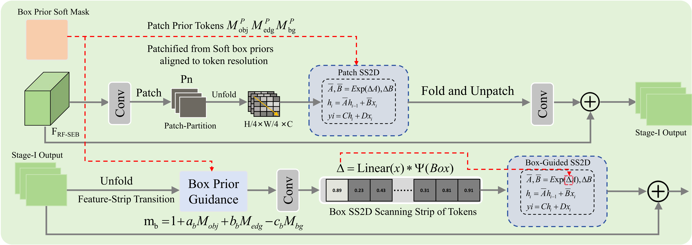
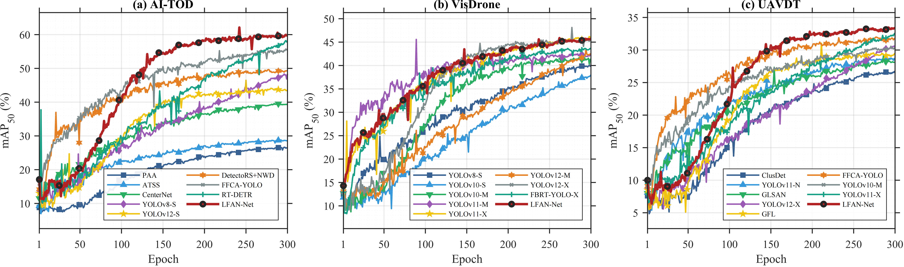

# LFAN-Net

Official minimal training code for **LFAN-Net: Label-Guided Frequency Alignment Network for Tiny Object Detection in Remote Sensing**.

This repository contains the cleaned training implementation of LFAN-Net. It keeps only the source code and configuration files required for training. Pretrained weights, datasets, experiment logs, and paper drafting files are not included.

## Overview

LFAN-Net is designed for tiny object detection in remote sensing scenes. It introduces label-guided frequency alignment modules into a YOLO-style detection framework to improve tiny-object feature representation under dense layouts, scale variation, and complex background interference.







## Directory Structure

```text
LFAN-Net/
+-- assert/                 # Paper figures and visual materials
+-- cfg/                    # Model and dataset configuration files
|   +-- datasets/           # AI-TOD, VisDrone, and UAVDT YAML files
|   +-- models/FAN-Net/     # LFAN-Net model YAML files
+-- cli/                    # Command-line argument parser
+-- data/                   # Dataset loading and augmentation code
+-- engine/                 # Training, validation, prediction, and runtime engine
+-- hub/                    # Compatibility utilities retained from the training framework
+-- models/                 # Detection model interface
+-- nn/                     # Network definitions, including LFAN modules
+-- utils/                  # Losses, metrics, plotting, and training utilities
+-- train.py                # Main training entrance
+-- pyproject.toml          # Python package metadata and dependencies
+-- version.py              # Project version
```

The core LFAN implementation is located in:

```text
nn/modules/fan.py
```

The model configuration files are located in:

```text
cfg/models/FAN-Net/
```

## Installation

Create a Python environment and install the package in editable mode:

```bash
conda create -n lfan python=3.10 -y
conda activate lfan
pip install -e .
```

If PyTorch is not installed, install the version matching your CUDA environment. For example:

```bash
pip install torch torchvision --index-url https://download.pytorch.org/whl/cu121
```

If OpenCV is missing, install it with:

```bash
pip install opencv-python
```

## Dataset Preparation

Datasets are not included in this repository. Please download AI-TOD, VisDrone, or UAVDT from their official sources and convert or organize them in YOLO detection format.

Dataset configuration templates are provided:

```text
cfg/datasets/AI-TOD.yaml
cfg/datasets/VisDrone.yaml
cfg/datasets/UAVDT.yaml
```

Before training, edit the selected YAML file and set the dataset root path correctly. A typical YOLO-style structure is:

```text
dataset_root/
+-- images/
|   +-- train/
|   +-- val/
+-- labels/
    +-- train/
    +-- val/
```

## Training

Train LFAN-Net from a model configuration file:

```bash
python train.py --model cfg/models/FAN-Net/fan_yolo11n.yaml --data cfg/datasets/VisDrone.yaml --pretrained false
```

Examples for the three datasets:

```bash
python train.py --model cfg/models/FAN-Net/fan_yolo11n.yaml --data cfg/datasets/AI-TOD.yaml --pretrained false
python train.py --model cfg/models/FAN-Net/fan_yolo11n.yaml --data cfg/datasets/VisDrone.yaml --pretrained false
python train.py --model cfg/models/FAN-Net/fan_yolo11n.yaml --data cfg/datasets/UAVDT.yaml --pretrained false
```

Available model scales:

```text
fan_yolo11n.yaml
fan_yolo11s.yaml
fan_yolo11m.yaml
fan_yolo11l.yaml
fan_yolo11x.yaml
```

Fast variants are also provided:

```text
fan_yolo11n_fast.yaml
fan_yolo11s_fast.yaml
fan_yolo11m_fast.yaml
fan_yolo11l_fast.yaml
fan_yolo11x_fast.yaml
```

Training outputs are saved under the path controlled by `--project` and `--name`. The default arguments are defined in:

```text
cli/parser.py
```

## Notes

- Pretrained `.pt` weights are not included.
- Datasets, labels, and experiment logs are not included.
- The default examples use `--pretrained false` to avoid relying on local pretrained weights.
- Dataset paths in YAML files must be updated before training.
- The figures used in the paper are placed in `assert/`.

## License

This code is released for academic research. The training framework is derived from an AGPL-3.0 codebase, and inherited license terms should be respected.
